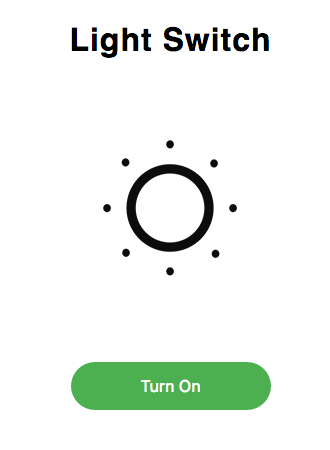
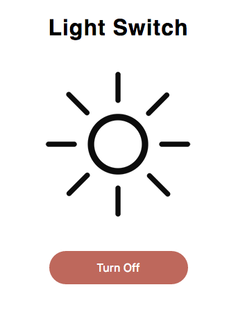
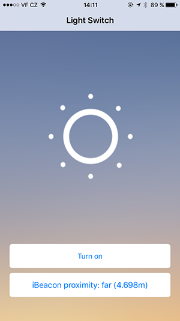
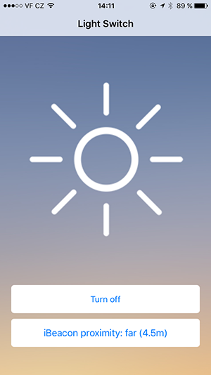

# MI-IOT semestral project
Raspberry Pi iBeacon light switch

## Introduction

This is a simple implementation of the iBeacon light switch running on a Raspberry Pi 3 (or older with a Bluetooth 4.0 USB receiver). Raspberry simulates the iBeacon transmitter (via bluez), which communicates with an iOS application in user's mobile phone. When the user moves into the iBeacon defined region, Raspberry turns on the light. After user leaves the region, Raspberry turns off the light. Raspberry also runs a simple Node.js server, which listens to HTTP requests for turn on/off the light and informs all clients about the change via WebSockets. 

## Scripts
- `ibeacon-setup.sh` - install bluez 5.39 and all dependencies
- `ibeacon-start.sh` - start virtual iBeacon advertising
- `ibeacon-stop.sh` - stop virtual iBeacon advertising

## Backend
### Resource: light

```json
{
	"val": Bool,
}
```

### HTTP API (port 8080)

GET /light - get light state (true/false)  
Status codes: 200 - ok, 400 - bad request

PUT /light - update light state  
Status codes: 200 - ok, 400 - bad request  
Inform all clients about the change via WebSocket broadcast

### WebSocket server (port 8888)

WebSocketServer.on('connection')  
Action: send actual light state (true/false) 

WebSocket.on('message') == "true"/"false"  
Action: update light state and inform all clients via broadcast

### Usage

- `cd backend`
- `npm install`
- `node server.js`

## Web Client

### Usage

- Change HTTP API and WebSocket server URLs in client.html to an IP of your Raspberry
- Open client.html in your browser

### Screenshots




## iOS Client

### Usage

- `cd ios-client`
- `pod install`
- Open iot-semestral.xcworkspace in XCode
- Change HTTP API and WebSocket server URLs in HomeViewController.swift to an IP of your Raspberry
- Run the application on your iOS device (Apple Developer Program membership required)

### Screenshots



